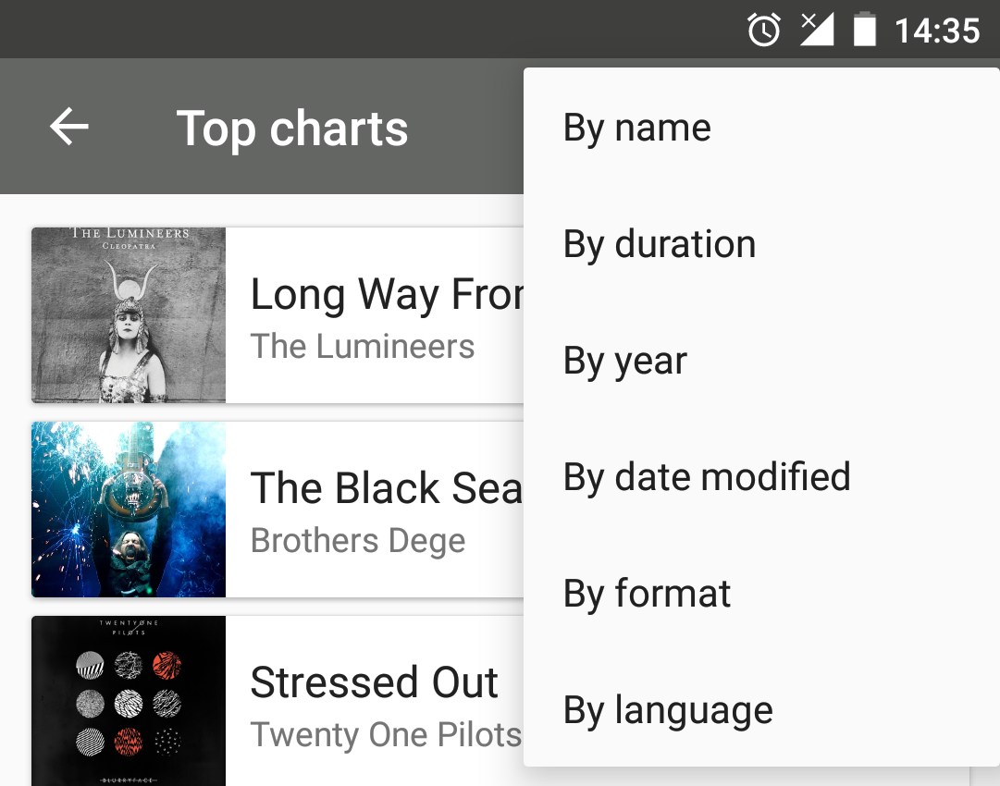

# Music Player for Local storage mp3 files for Android

## Getting Started (current Legacy way): 
1. Create account and get API key on [MusixMatch](https://developer.musixmatch.com) -> enter API key in `local.properties`: `MUSIXMATCH_API_KEY_PROD=<your_api_key>`
2. Connect device via USB or Wi-Fi and allow debugging in `Settings` -> `Developer options` -> `Debugging` 
- Note:
  To show `dev options` section requires multiple taps on `Settings` -> `About phone` -> `Build number`
3. Push music files via command: `adb -s <device_id> push <path to audio file on PC with file extension mp3> /sdcard/Download/<album_directory>/`

- Important note:
  `album_directory` is important for correct association songs to album
  `/sdcard/Download` is required path for audio files to be found

4. Compile & run app -> click on `3 dots` in Toolbar -> select `Add all audio files from SD` -> files are shown immediately or try to restart app 

## Architecture & refactoring (WIP):
1. Java -> Kotlin
2. God Activity/Fragment -> MVVM (Jetpack ViewModel) -> MVI ? + Clean (Presentation/Domain/Data) -> modularization via splitting on feature-modules -> share business logic for diff platforms via Kotlin Multiplatform ?
3. LiveData -> Kotlin Flow
4. SQLOpenHelper DB -> Room
5. AsyncTask/Threads/Handlers -> Kotlin Coroutines
6. RelativeLayout and nested layouts -> ConstraintLayout -> Compose ?
7. findViewById -> ViewBinding
8. Static dependencies -> Dagger 2 -> Hilt ?
9. Raw navigation calls -> Navigator abstraction
10. ViewPager -> ViewPager2
11. Android and 3rd party libs: 
  player bg color based on album cover colors - Palette API
  audio playing - MediaPlayer API
  photo - Picasso -> Glide ?
  html parsing - Jsoup -> OkHttp + Retrofit ?
  logging: Log -> Timber
  testing: unit/integration - JUnit/Mockito, ui - Espresso, coverage - Kover
12. CI/CD: JetBrains TeamCity + Microsoft App Center

## Product features:
## Portrait
| | | |
|:-------------------------:|:-------------------------:|:-------------------------:|
|||
||   ||
|||

## Landscape
| |
|:-------------------------:|
||

## OS requirements and limitations:
- SDK versions: min 21 (Android 5.0), target 32 (Android 12)
- localization: English
- audio files: mp3
- audio source: local storage
- orientation: portrait/landscape
- device type: smartphone
- themes: Day/Night (TODO)

## 3rd party APIs:
- [MusixMatch API](https://developer.musixmatch.com/) for: song lyrics, song lyrics language and song album cover.
